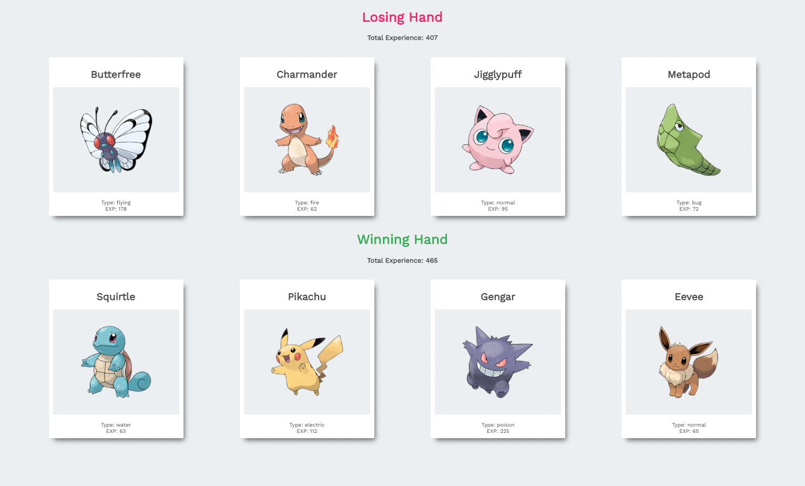

# Pokedex Project

This project was made based on Colt Steele's Udemy course [The Modern React Bootcamp](https://www.udemy.com/course/modern-react-bootcamp/). It is a basic React app that compares two unique hands of Pokemon cards and calculates which is the winning hand.

## Future Development

While good practice for learning the basics of React, the app as presented in the course has limited functionality. For starters, I would love to include more Pokemon by pulling directly from the [PokeAPI](https://pokeapi.co/). Also, I would improve the game aspect to take into account Pokemon type, just like in the original video games.

## Run the App

`npm start`

Runs the app in the development mode.\
Open [http://localhost:3000](http://localhost:3000) to view it in your browser.